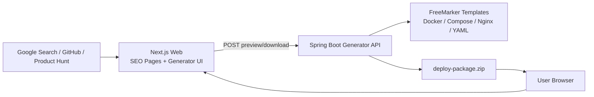
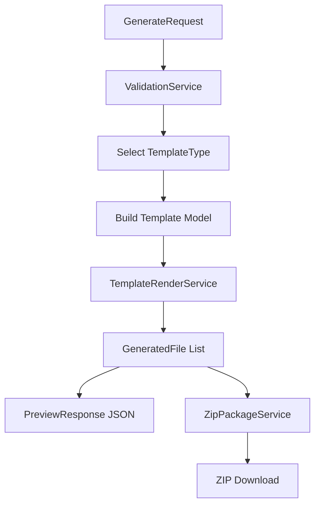
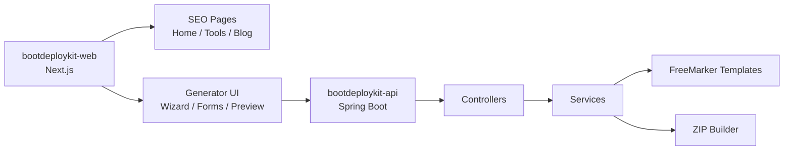

# BootDeployKit 项目方案与架构说明

> 这份文档可以直接复制给 AI，让 AI 按模块生成完整代码。项目目标不是做普通开发者工具合集，而是做一个垂直的 Spring Boot 部署包生成器。

---

## 0. 直接给 AI 的总提示词

```text
你现在是一个全栈架构师和高级 Java/Spring Boot + Next.js 工程师。

我要开发一个英文 SEO 工具站，项目名叫 BootDeployKit。

项目定位：
BootDeployKit is a Spring Boot Docker Deployment Generator. It helps Java backend developers generate production-ready Dockerfile, docker-compose.yml, Nginx config, MySQL, Redis, Nacos and Spring Boot application-prod.yml files online.

技术栈：
1. 前端：Next.js App Router + TypeScript + Tailwind CSS
2. 后端：Spring Boot 3.x + Java 17 + FreeMarker
3. 后端负责根据用户输入渲染部署模板，并返回文件预览或 ZIP 下载
4. 第一版不需要数据库
5. 前端需要 SEO 友好，需要 metadata、sitemap.ts、robots.ts
6. 后端需要 CORS、参数校验、全局异常处理

核心功能：
1. 用户选择部署模板
2. 用户填写项目参数
3. 前端调用 POST /api/v1/generate/preview 预览生成文件
4. 前端调用 POST /api/v1/generate/download 下载 ZIP
5. ZIP 中包含 Dockerfile、docker-compose.yml、nginx/default.conf、config/application-prod.yml、scripts/deploy.sh、README.md

支持模板：
1. SPRING_BOOT_BASIC
2. SPRING_BOOT_MYSQL_REDIS
3. SPRING_BOOT_NGINX
4. SPRING_CLOUD_NACOS

请你先输出完整项目目录结构，然后按模块生成代码。
不要省略关键代码。
每个文件都要给出完整路径和完整代码。
先从后端 Spring Boot 项目开始。
```

---

## 1. 项目定位

### 项目名称

```text
BootDeployKit
```

### SEO 主标题

```text
Spring Boot Docker Deployment Generator | BootDeployKit
```

### 一句话定位

```text
Generate production-ready Dockerfile, docker-compose.yml, Nginx config, MySQL, Redis, Nacos and Spring Boot application.yml files online.
```

### 中文解释

BootDeployKit 是一个面向 Java 后端程序员的在线部署包生成器。用户填写项目名称、JAR 包名、端口、域名、是否启用 MySQL、Redis、Nginx、Nacos 等参数后，系统自动生成可下载的部署 ZIP 包。

ZIP 包包含：

```text
Dockerfile
docker-compose.yml
.env.example
nginx/default.conf
config/application-prod.yml
scripts/deploy.sh
scripts/restart.sh
scripts/logs.sh
README.md
```

### 不要做什么

不要做成普通工具合集，例如 JSON Formatter、JWT Decoder、Cron Generator 这种大杂烩。这个方向竞争已经非常大。

### 应该做什么

聚焦一个更垂直的方向：

```text
Spring Boot 项目上线部署包生成器
Java 后端 Docker 部署文件生成器
Spring Cloud + Nacos 部署模板生成器
```

---

## 2. 商业逻辑

### 核心增长逻辑

```text
英文 SEO 工具页
    ↓
开发者搜索 Spring Boot Docker / Nginx / Compose 问题
    ↓
进入 BootDeployKit 工具页
    ↓
免费生成部署文件
    ↓
收藏 / 分享 / GitHub Star
    ↓
后期通过广告、Pro 模板、源码售卖、API 变现
```

### 变现路径

| 阶段 | 方式 | 说明 |
|---|---|---|
| 初期 | 免费工具 + SEO | 先获取收录和开发者流量 |
| 中期 | AdSense / Carbon Ads | 工具页、教程页放广告 |
| 中期 | Pro 模板 | 高级部署模板、微服务模板、保存历史 |
| 后期 | 源码售卖 | Gumroad / Lemon Squeezy / CodeCanyon |
| 后期 | API 变现 | 把生成能力封装成 API |
| 长期 | 外包 / 定制 | 用网站作为作品集接海外项目 |

---

## 3. MVP 第一版功能范围

第一版只做一个核心功能：

```text
Spring Boot Deployment ZIP Generator
```

用户填写表单后，系统生成部署文件预览和 ZIP 下载。

### 第一版支持模板

| 模板代码 | 模板名称 | 说明 |
|---|---|---|
| SPRING_BOOT_BASIC | Spring Boot Basic Deployment | 单体 Spring Boot Docker 部署 |
| SPRING_BOOT_MYSQL_REDIS | Spring Boot + MySQL + Redis | 生成 app + mysql + redis 的 docker-compose |
| SPRING_BOOT_NGINX | Spring Boot + Nginx | 生成 Nginx 反向代理配置 |
| SPRING_CLOUD_NACOS | Spring Cloud Gateway + Nacos | 生成微服务网关和 Nacos 部署模板 |

### 用户表单字段

#### ProjectConfig

| 字段 | 示例 | 说明 |
|---|---|---|
| projectName | demo-api | 项目名，也是容器名基础 |
| jarFileName | demo-api.jar | 用户自己的 Spring Boot JAR 包名 |
| javaVersion | 17 | Java 版本 |
| serverPort | 8080 | Spring Boot 服务端口 |
| springProfile | prod | Spring Profile |
| logPath | ./logs | 宿主机日志目录 |
| dockerNetwork | app-network | Docker 网络名 |

#### DatabaseConfig

| 字段 | 示例 | 说明 |
|---|---|---|
| enabled | true | 是否启用 MySQL |
| databaseName | demo_db | 数据库名 |
| username | demo | 数据库用户 |
| password | demo_password | 数据库密码 |
| rootPassword | root_password | MySQL root 密码 |
| port | 3306 | 宿主机映射端口 |

#### RedisConfig

| 字段 | 示例 | 说明 |
|---|---|---|
| enabled | true | 是否启用 Redis |
| port | 6379 | 宿主机映射端口 |
| password | 空 | Redis 密码，第一版可选 |

#### NginxConfig

| 字段 | 示例 | 说明 |
|---|---|---|
| enabled | true | 是否启用 Nginx |
| domain | example.com | 域名 |
| https | false | 第一版先生成 HTTP，后续再支持 HTTPS/Certbot |

#### NacosConfig

| 字段 | 示例 | 说明 |
|---|---|---|
| enabled | true | 是否启用 Nacos |
| port | 8848 | Nacos 端口 |
| username | nacos | Nacos 用户名 |
| password | nacos | Nacos 密码 |
| mode | standalone | Nacos 模式 |

---

## 4. 总体架构图



### 架构说明

| 层 | 技术 | 职责 |
|---|---|---|
| 前端 | Next.js + TypeScript + Tailwind CSS | SEO 页面、表单、文件预览、下载入口 |
| 后端 | Spring Boot 3.x + Java 17 | 参数校验、模板渲染、ZIP 打包 |
| 模板引擎 | FreeMarker | 渲染 Dockerfile、YAML、Nginx、Shell、README |
| 部署 | Vercel + Docker Server | 前端部署到 Vercel，后端 Docker 部署 |
| 数据库 | 第一版不需要 | 不保存用户敏感配置 |

---

## 5. 后端生成流程图



### 后端核心流程

```text
1. 接收 GenerateRequest
2. ValidationService 校验参数
3. 根据 templateType 选择模板目录
4. 构建 FreeMarker 渲染模型
5. TemplateRenderService 渲染模板文件
6. 生成 GeneratedFile 列表
7. preview 接口返回 JSON
8. download 接口把 GeneratedFile 打包成 ZIP 返回
```

---

## 6. 模块架构图



---

## 7. 前端架构设计

### 前端技术栈

```text
Next.js App Router
TypeScript
Tailwind CSS
React Server Components + Client Components
Fetch API
```

### 前端目录结构

```text
bootdeploykit-web/
├── app/
│   ├── layout.tsx
│   ├── page.tsx
│   ├── sitemap.ts
│   ├── robots.ts
│   ├── tools/
│   │   ├── spring-boot-docker-generator/
│   │   │   └── page.tsx
│   │   ├── spring-boot-nginx-generator/
│   │   │   └── page.tsx
│   │   ├── docker-compose-spring-boot-mysql-redis/
│   │   │   └── page.tsx
│   │   └── spring-cloud-nacos-generator/
│   │       └── page.tsx
│   ├── blog/
│   │   ├── spring-boot-docker-deployment/
│   │   │   └── page.tsx
│   │   ├── spring-boot-nginx-reverse-proxy/
│   │   │   └── page.tsx
│   │   └── docker-compose-mysql-redis-spring-boot/
│   │       └── page.tsx
│   ├── privacy/
│   │   └── page.tsx
│   ├── terms/
│   │   └── page.tsx
│   └── contact/
│       └── page.tsx
├── components/
│   ├── generator/
│   │   ├── DeploymentWizard.tsx
│   │   ├── ProjectForm.tsx
│   │   ├── DependencySelector.tsx
│   │   ├── NginxForm.tsx
│   │   ├── NacosForm.tsx
│   │   ├── FilePreview.tsx
│   │   └── DownloadButton.tsx
│   ├── seo/
│   │   ├── FAQSection.tsx
│   │   ├── HowToSection.tsx
│   │   └── RelatedTools.tsx
│   └── ui/
├── lib/
│   ├── api.ts
│   ├── seo.ts
│   └── constants.ts
├── types/
│   └── generator.ts
└── package.json
```

### 前端页面清单

| 页面 | URL | SEO 关键词 |
|---|---|---|
| 首页 | / | spring boot docker deployment generator |
| Docker 工具页 | /tools/spring-boot-docker-generator | spring boot dockerfile generator |
| Compose 工具页 | /tools/docker-compose-spring-boot-mysql-redis | docker compose spring boot mysql redis |
| Nginx 工具页 | /tools/spring-boot-nginx-generator | spring boot nginx reverse proxy generator |
| Nacos 工具页 | /tools/spring-cloud-nacos-generator | spring cloud nacos docker compose |
| 教程页 | /blog/spring-boot-docker-deployment | how to deploy spring boot with docker |
| Privacy | /privacy | 隐私政策 |
| Terms | /terms | 使用条款 |
| Contact | /contact | 联系页面 |

---

## 8. 后端架构设计

### 后端技术栈

```text
Java 17
Spring Boot 3.x
Spring Web
Spring Validation
FreeMarker
Maven
Java ZipOutputStream
```

### 后端目录结构

```text
bootdeploykit-api/
├── src/main/java/com/bootdeploykit/
│   ├── BootDeployKitApplication.java
│   ├── controller/
│   │   ├── GeneratorController.java
│   │   ├── TemplateController.java
│   │   └── HealthController.java
│   ├── service/
│   │   ├── DeploymentGeneratorService.java
│   │   ├── TemplateRenderService.java
│   │   ├── ZipPackageService.java
│   │   └── ValidationService.java
│   ├── model/
│   │   ├── request/
│   │   │   ├── GenerateRequest.java
│   │   │   ├── ProjectConfig.java
│   │   │   ├── DatabaseConfig.java
│   │   │   ├── RedisConfig.java
│   │   │   ├── NginxConfig.java
│   │   │   └── NacosConfig.java
│   │   ├── response/
│   │   │   ├── PreviewResponse.java
│   │   │   ├── GeneratedFile.java
│   │   │   └── TemplateInfo.java
│   │   └── enums/
│   │       ├── TemplateType.java
│   │       └── JavaVersion.java
│   ├── exception/
│   │   ├── GlobalExceptionHandler.java
│   │   └── BizException.java
│   └── config/
│       ├── CorsConfig.java
│       └── FreemarkerConfig.java
├── src/main/resources/
│   ├── application.yml
│   └── templates/
│       ├── spring-boot-basic/
│       │   ├── Dockerfile.ftl
│       │   ├── docker-compose.yml.ftl
│       │   ├── application-prod.yml.ftl
│       │   ├── deploy.sh.ftl
│       │   └── README.md.ftl
│       ├── spring-boot-mysql-redis/
│       ├── spring-boot-nginx/
│       └── spring-cloud-nacos/
└── pom.xml
```

---

## 9. API 设计

### 9.1 获取模板列表

```http
GET /api/v1/templates
```

返回示例：

```json
[
  {
    "code": "SPRING_BOOT_BASIC",
    "name": "Spring Boot Basic Deployment",
    "description": "Generate Dockerfile, docker-compose.yml and application-prod.yml for a single Spring Boot app."
  },
  {
    "code": "SPRING_BOOT_MYSQL_REDIS",
    "name": "Spring Boot + MySQL + Redis",
    "description": "Generate a Docker Compose stack for Spring Boot, MySQL and Redis."
  }
]
```

### 9.2 预览生成文件

```http
POST /api/v1/generate/preview
Content-Type: application/json
```

请求示例：

```json
{
  "templateType": "SPRING_BOOT_MYSQL_REDIS",
  "project": {
    "projectName": "demo-api",
    "jarFileName": "demo-api.jar",
    "javaVersion": "17",
    "serverPort": 8080,
    "springProfile": "prod",
    "logPath": "./logs",
    "dockerNetwork": "app-network"
  },
  "database": {
    "enabled": true,
    "type": "mysql",
    "databaseName": "demo_db",
    "username": "demo",
    "password": "demo_password",
    "rootPassword": "root_password",
    "port": 3306
  },
  "redis": {
    "enabled": true,
    "port": 6379,
    "password": ""
  },
  "nginx": {
    "enabled": true,
    "domain": "example.com",
    "https": false
  },
  "nacos": {
    "enabled": false
  }
}
```

返回示例：

```json
{
  "files": [
    {
      "path": "Dockerfile",
      "language": "dockerfile",
      "content": "FROM eclipse-temurin:17-jre..."
    },
    {
      "path": "docker-compose.yml",
      "language": "yaml",
      "content": "services: ..."
    }
  ]
}
```

### 9.3 下载 ZIP

```http
POST /api/v1/generate/download
Content-Type: application/json
```

响应：

```text
Content-Type: application/zip
Content-Disposition: attachment; filename="demo-api-deploy-package.zip"
```

### 9.4 健康检查

```http
GET /health
```

返回：

```json
{
  "status": "UP"
}
```

---

## 10. FreeMarker 模板设计

### Dockerfile.ftl

```dockerfile
FROM eclipse-temurin:${project.javaVersion}-jre

WORKDIR /app

COPY ${project.jarFileName} app.jar

ENV SPRING_PROFILES_ACTIVE=${project.springProfile}

EXPOSE ${project.serverPort}

ENTRYPOINT ["java", "-jar", "app.jar"]
```

### docker-compose.yml.ftl

```yaml
services:
  ${project.projectName}:
    build:
      context: .
      dockerfile: Dockerfile
    container_name: ${project.projectName}
    restart: always
    ports:
      - "${project.serverPort}:${project.serverPort}"
    environment:
      SPRING_PROFILES_ACTIVE: ${project.springProfile}
<#if database.enabled>
      SPRING_DATASOURCE_URL: jdbc:mysql://mysql:3306/${database.databaseName}?useUnicode=true&characterEncoding=utf8&serverTimezone=UTC
      SPRING_DATASOURCE_USERNAME: ${database.username}
      SPRING_DATASOURCE_PASSWORD: ${database.password}
</#if>
<#if redis.enabled>
      SPRING_REDIS_HOST: redis
      SPRING_REDIS_PORT: 6379
</#if>
    volumes:
      - ${project.logPath}:/app/logs
    networks:
      - ${project.dockerNetwork}
<#if database.enabled || redis.enabled>
    depends_on:
<#if database.enabled>
      - mysql
</#if>
<#if redis.enabled>
      - redis
</#if>
</#if>

<#if database.enabled>
  mysql:
    image: mysql:8.0
    container_name: ${project.projectName}-mysql
    restart: always
    environment:
      MYSQL_ROOT_PASSWORD: ${database.rootPassword}
      MYSQL_DATABASE: ${database.databaseName}
      MYSQL_USER: ${database.username}
      MYSQL_PASSWORD: ${database.password}
    ports:
      - "${database.port}:3306"
    volumes:
      - mysql-data:/var/lib/mysql
    networks:
      - ${project.dockerNetwork}
</#if>

<#if redis.enabled>
  redis:
    image: redis:7
    container_name: ${project.projectName}-redis
    restart: always
    ports:
      - "${redis.port}:6379"
    networks:
      - ${project.dockerNetwork}
</#if>

networks:
  ${project.dockerNetwork}:
    driver: bridge

volumes:
<#if database.enabled>
  mysql-data:
</#if>
```

### nginx/default.conf.ftl

```nginx
server {
    listen 80;
    server_name ${nginx.domain};

    location / {
        proxy_pass http://${project.projectName}:${project.serverPort};
        proxy_set_header Host $host;
        proxy_set_header X-Real-IP $remote_addr;
        proxy_set_header X-Forwarded-For $proxy_add_x_forwarded_for;
        proxy_set_header X-Forwarded-Proto $scheme;
    }
}
```

### deploy.sh.ftl

```bash
#!/bin/bash

set -e

echo "Building and starting ${project.projectName}..."

docker compose down
docker compose up -d --build

echo "Deployment completed."
docker compose ps
```

### README.md.ftl 需要包含

```text
1. 项目说明
2. 文件结构
3. 前置要求：Docker、Docker Compose
4. 如何放置自己的 JAR 包
5. 如何修改 .env
6. 如何启动
7. 如何查看日志
8. 如何重启
9. 常见错误
10. 安全提醒：上线前修改默认密码
```

---

## 11. ZIP 包结构

```text
${projectName}-deploy-package.zip
├── Dockerfile
├── docker-compose.yml
├── .env.example
├── nginx/
│   └── default.conf
├── config/
│   └── application-prod.yml
├── scripts/
│   ├── deploy.sh
│   ├── restart.sh
│   └── logs.sh
└── README.md
```

---

## 12. 用户使用流程

```text
1. 打开 BootDeployKit 网站
2. 选择部署模板，例如 Spring Boot + MySQL + Redis
3. 填写项目名、JAR 包名、端口、域名、数据库账号等
4. 点击 Preview Files
5. 查看 Dockerfile、docker-compose.yml、nginx.conf、application-prod.yml
6. 点击 Download ZIP
7. 解压 ZIP
8. 把自己的 Spring Boot JAR 包放到 ZIP 解压目录
9. 执行 chmod +x scripts/deploy.sh
10. 执行 ./scripts/deploy.sh
11. 使用 docker compose logs -f 查看日志
```

---

## 13. SEO 页面设计

### 首页

URL：

```text
/
```

Title：

```text
Spring Boot Docker Deployment Generator | BootDeployKit
```

Description：

```text
Generate production-ready Dockerfile, docker-compose.yml, Nginx config, MySQL, Redis, Nacos and Spring Boot application.yml files online.
```

H1：

```text
Spring Boot Docker Deployment Generator
```

首页结构：

```text
H1
副标题
Generate Deployment Files 按钮
支持的部署模板
生成文件示例
为什么使用 BootDeployKit
FAQ
相关文章
```

### 工具页

| URL | Title | H1 |
|---|---|---|
| /tools/spring-boot-docker-generator | Spring Boot Dockerfile Generator | Spring Boot Dockerfile Generator |
| /tools/docker-compose-spring-boot-mysql-redis | Docker Compose Generator for Spring Boot, MySQL and Redis | Docker Compose Generator for Spring Boot + MySQL + Redis |
| /tools/spring-boot-nginx-generator | Spring Boot Nginx Reverse Proxy Generator | Spring Boot Nginx Reverse Proxy Generator |
| /tools/spring-cloud-nacos-generator | Spring Cloud Nacos Docker Compose Generator | Spring Cloud Nacos Docker Compose Generator |

### 第一批教程文章

```text
How to Deploy a Spring Boot Application with Docker
How to Generate a Dockerfile for Spring Boot
How to Use Docker Compose with Spring Boot, MySQL and Redis
How to Configure Nginx Reverse Proxy for Spring Boot
How to Deploy Spring Boot Behind Nginx with Docker Compose
How to Configure application-prod.yml for Spring Boot
How to Deploy Spring Cloud Gateway with Nacos
Common Spring Boot Docker Deployment Mistakes
Docker Volume Mapping for Spring Boot Logs
Spring Boot Environment Variables in Docker Compose
```

每篇文章结构：

```text
H1
问题背景
完整配置示例
每一段配置解释
常见错误
推荐使用 BootDeployKit 自动生成
FAQ
```

---

## 14. 安全设计

第一版必须遵守：

```text
1. 不保存用户数据库密码
2. 不要求用户上传 JAR 包
3. 不执行用户输入的命令
4. 不允许路径穿越
5. 下载文件名要过滤特殊字符
6. 接口加请求体大小限制
7. 生成内容只作为文本文件返回，不在服务器执行
8. 对 projectName、jarFileName、domain 做格式校验
9. 避免在日志中打印完整 request body
10. README 中提醒用户上线前修改默认密码
```

建议校验规则：

| 字段 | 规则 |
|---|---|
| projectName | 只允许小写字母、数字、横线，长度 2-50 |
| jarFileName | 只允许字母、数字、横线、下划线、点，必须以 .jar 结尾 |
| domain | 简单域名格式校验，不允许协议头 |
| serverPort | 1-65535 |
| logPath | 不允许包含 .. |
| dockerNetwork | 只允许字母、数字、横线、下划线 |

---

## 15. 部署方案

### 前端部署

```text
平台：Vercel
域名：https://bootdeploykit.com
环境变量：NEXT_PUBLIC_API_BASE_URL=https://api.bootdeploykit.com
```

### 后端部署

后端 Dockerfile：

```dockerfile
FROM eclipse-temurin:17-jre
WORKDIR /app
COPY target/bootdeploykit-api.jar app.jar
EXPOSE 8080
ENTRYPOINT ["java", "-jar", "app.jar"]
```

后端 docker-compose.yml：

```yaml
services:
  bootdeploykit-api:
    build: .
    container_name: bootdeploykit-api
    restart: always
    ports:
      - "8080:8080"
    environment:
      SPRING_PROFILES_ACTIVE: prod
```

Nginx 反向代理：

```nginx
server {
    listen 80;
    server_name api.bootdeploykit.com;

    location / {
        proxy_pass http://127.0.0.1:8080;
        proxy_set_header Host $host;
        proxy_set_header X-Real-IP $remote_addr;
        proxy_set_header X-Forwarded-For $proxy_add_x_forwarded_for;
        proxy_set_header X-Forwarded-Proto $scheme;
    }
}
```

---

## 16. 开发任务拆分

### 阶段 1：后端基础

```text
1. 创建 Spring Boot 3.x 项目
2. 创建 DTO 和枚举
3. 创建模板列表接口
4. 创建参数校验服务
5. 创建 FreeMarker 渲染服务
6. 创建 ZIP 打包服务
7. 创建 preview/download 接口
8. 创建全局异常处理
9. 创建 CORS 配置
10. 本地测试接口
```

### 阶段 2：模板文件

```text
1. spring-boot-basic 模板
2. spring-boot-mysql-redis 模板
3. spring-boot-nginx 模板
4. spring-cloud-nacos 模板
5. README.md 自动生成
6. deploy.sh/restart.sh/logs.sh 脚本生成
```

### 阶段 3：前端页面

```text
1. 创建 Next.js 项目
2. 创建首页
3. 创建 4 个工具页
4. 创建 DeploymentWizard
5. 创建 ProjectForm
6. 创建 DependencySelector
7. 创建 FilePreview
8. 创建 DownloadButton
9. 接入后端 preview/download 接口
10. 完成响应式布局
```

### 阶段 4：SEO 内容

```text
1. 每个页面配置 metadata
2. 创建 sitemap.ts
3. 创建 robots.ts
4. 创建 Privacy 页面
5. 创建 Terms 页面
6. 创建 Contact 页面
7. 写 10 篇教程文章
8. 提交 Google Search Console
```

---

## 17. AI 分模块提示词

### 17.1 后端代码生成提示词

```text
请为 BootDeployKit 生成后端 Spring Boot 项目代码。

要求：
1. 使用 Java 17、Spring Boot 3.x、Maven
2. 包名：com.bootdeploykit
3. 提供以下接口：
   - GET /api/v1/templates
   - POST /api/v1/generate/preview
   - POST /api/v1/generate/download
   - GET /health
4. 使用 FreeMarker 渲染模板
5. 使用 Java ZipOutputStream 生成 ZIP
6. DTO 包括：
   - GenerateRequest
   - ProjectConfig
   - DatabaseConfig
   - RedisConfig
   - NginxConfig
   - NacosConfig
   - PreviewResponse
   - GeneratedFile
   - TemplateInfo
7. Service 包括：
   - DeploymentGeneratorService
   - TemplateRenderService
   - ZipPackageService
   - ValidationService
8. 需要全局异常处理 GlobalExceptionHandler
9. 需要 CORS 配置
10. 先生成完整 Maven pom.xml，再生成所有 Java 文件。
```

### 17.2 FreeMarker 模板生成提示词

```text
请为 BootDeployKit 后端生成 FreeMarker 模板文件。

模板目录：
src/main/resources/templates/

需要支持 4 个模板：
1. spring-boot-basic
2. spring-boot-mysql-redis
3. spring-boot-nginx
4. spring-cloud-nacos

每个模板至少包含：
- Dockerfile.ftl
- docker-compose.yml.ftl
- application-prod.yml.ftl
- README.md.ftl
- deploy.sh.ftl

spring-boot-nginx 还需要：
- nginx/default.conf.ftl

spring-cloud-nacos 还需要：
- gateway-application.yml.ftl
- nacos-docker-compose.yml.ftl

要求：
1. 模板变量来自 GenerateRequest
2. 配置要适合生产部署
3. Docker Compose 使用 bridge network
4. 日志目录要做 volume 映射
5. README.md 要包含完整使用步骤
6. 不要写死项目名、端口、域名、数据库账号
```

### 17.3 前端代码生成提示词

```text
请为 BootDeployKit 生成前端 Next.js 项目代码。

技术栈：
- Next.js App Router
- TypeScript
- Tailwind CSS
- 不使用复杂 UI 库，保持干净简洁
- 需要响应式布局
- 需要 SEO metadata

页面：
1. /
2. /tools/spring-boot-docker-generator
3. /tools/docker-compose-spring-boot-mysql-redis
4. /tools/spring-boot-nginx-generator
5. /tools/spring-cloud-nacos-generator
6. /blog/spring-boot-docker-deployment
7. /privacy
8. /terms
9. /contact

组件：
1. DeploymentWizard
2. ProjectForm
3. DependencySelector
4. NginxForm
5. NacosForm
6. FilePreview
7. DownloadButton
8. FAQSection
9. RelatedTools

功能：
1. 用户填写部署参数
2. 点击 Preview Files 调用后端 /api/v1/generate/preview
3. 显示生成文件列表和代码内容
4. 点击 Download ZIP 调用 /api/v1/generate/download 并下载文件
5. 每个工具页都有独立 title 和 description
6. 生成 app/sitemap.ts 和 app/robots.ts

请先输出目录结构，再逐个文件生成完整代码。
```

### 17.4 部署文件生成提示词

```text
请为 BootDeployKit 生成完整部署方案。

需要输出：
1. 后端 Dockerfile
2. 后端 docker-compose.yml
3. Nginx 反向代理配置
4. 前端 Vercel 部署步骤
5. 后端服务器部署步骤
6. 环境变量说明
7. CORS 配置说明
8. Google Search Console 提交流程
9. 常见部署错误和解决方法

项目结构：
- bootdeploykit-web 是 Next.js 前端
- bootdeploykit-api 是 Spring Boot 后端

后端端口：8080
前端域名：https://bootdeploykit.com
后端 API 域名：https://api.bootdeploykit.com
```

---

## 18. 验收标准

### 功能验收

```text
能打开首页
能进入 4 个工具页
能填写表单
能预览 Dockerfile
能预览 docker-compose.yml
能预览 nginx/default.conf
能下载 ZIP
ZIP 解压后结构正确
deploy.sh 能执行
README.md 说明清楚
```

### SEO 验收

```text
每个页面有唯一 title
每个页面有唯一 description
H1 只有一个
URL 包含关键词
有 sitemap.xml
有 robots.txt
有 privacy 页面
有 terms 页面
有 contact 页面
工具页有 FAQ
工具页有文章说明
页面不是纯工具空页面
```

### 安全验收

```text
不保存用户数据库密码
不要求用户上传 jar 包
不执行用户输入的命令
不允许路径穿越
下载文件名要过滤特殊字符
接口加请求体大小限制
日志中不打印敏感 request body
```

---

## 19. 你现在的执行顺序

```text
第一步：让 AI 先生成 bootdeploykit-api 后端项目
第二步：后端本地跑通 preview/download 接口
第三步：让 AI 生成 FreeMarker 模板文件
第四步：测试生成 ZIP 包
第五步：让 AI 生成 bootdeploykit-web 前端项目
第六步：前后端联调
第七步：写 4 个工具页 + 10 篇文章
第八步：部署上线
第九步：提交 Google Search Console
第十步：发布 GitHub、Product Hunt、Hacker News Show HN
```

---

## 20. 最终项目口号

```text
BootDeployKit — Generate Spring Boot deployment files in minutes.
```

中文理解：

```text
BootDeployKit：几分钟生成 Spring Boot 上线部署文件。
```
